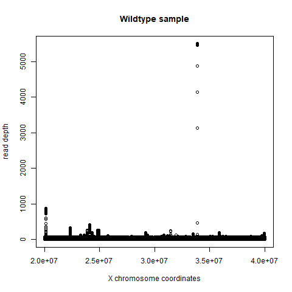

I worked with reference sequnce of chromosome X (from the hg19 version of the human genome) which can be downloaded from [here](https://hgdownload.soe.ucsc.edu/goldenPath/hg19/chromosomes/chrX.fa.gz) (working with the whole genome took a long time). Following workflow was used to obtain bam file with alignments:

```
bwa index chrX.fa
bwa mem chrX.fa tu.r1.fq.gz tu.r2.fq.gz | samtools sort -o aligned_tu.bam -
samtools index aligned_tu.bam

bwa mem chrX.fa wt.r1.fq.gz wt.r2.fq.gz | samtools sort -o aligned_wt.bam -
samtools index aligned_wt.bam
```

Filtering for our region of interest and getting the coverage:
```
samtools view -b aligned_tu.bam chrX:20000000-40000000 > filtered_tu.bam
samtools depth filtered_tu.bam > tu.coverage

samtools view -b aligned_wt.bam chrX:20000000-40000000 > filtered_wt.bam
samtools depth filtered_wt.bam > wt.coverage
```

Coverage files contain three columns - identifier of the chromosome, position on the chromosome and read depth. This means we can easily plot the read depth.

Plotting will be done in R. following code was used to generate the plots:
```
tu = read.csv("tu.coverage", sep = "\t")
wt = read.csv("wt.coverage", sep = "\t")

png('tumor.png')
plot(tu[,2], tu[,3], type = "p", xlab = "X chromosome coordinates", ylab = "read depth", main = "Tumor sample")
dev.off()

png('wildtype.png')
plot(wt[,2], wt[,3], type = "p", xlab = "X chromosome coordinates", ylab = "read depth", main = "Wildtype sample")
dev.off()
```

After this, we obtain these graphs:



